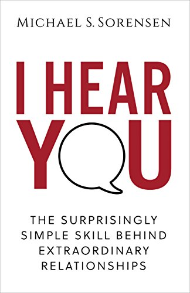
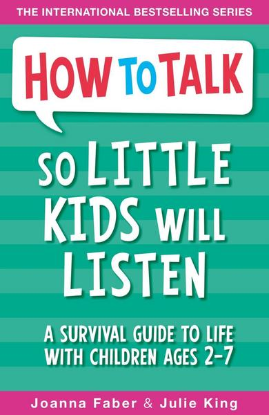
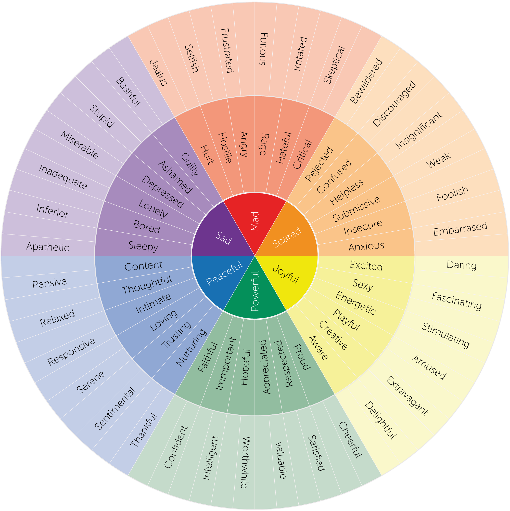

---
# try also 'default' to start simple
theme: ./mathema-2021

# infos for the footer (on slides with the default-with-footer layout)
occasion: "DWX2021"
occasionLogoUrl: "img/DWX_LogoIcon_2021_CMYK-scaled.jpg"
company: "Mathema"
presenter: "Martin Grotz"
contact: "martin.grotz@mathema.de"

# apply any windi css classes to the current slide
class: "text-center"

highlighter: shiki

defaults:
  layout: "default-with-footer"

info: |
  ## Zwischenmenschliche Validierung Slides

  Visit my blog at https://elm.finde-ich-super.de
  
layout: cover
---

# Zwischenmenschliche Validierung

### Martin Grotz

<!--
The last comment block of each slide will be treated as slide notes. It will be visible and editable in Presenter Mode along with the slide. [Read more in the docs](https://sli.dev/guide/syntax.html#notes)
-->

---

## tl;dr

Zwischenmenschliche Validierung bedeutet:

Im Dialog mit anderen
- spezifische Emotion erkennen
- Rechtfertigung für diese Emotion liefern

<!--
## Wer bin ich und was mache ich hier?

inklusive Einschränkungen
-->

---

## Wie bin ich darauf gestoßen?

---

## Agenda

- Emotionen
- Beziehungs-Wetten
- Zwischenmenschliche Validierung
  - Einfühlendes Zuhören
  - Validieren
  - Vorschläge/Lösungen
  - Validieren

---

## Emotionen

Photo by <a href="https://unsplash.com/@tengyart?utm_source=unsplash&utm_medium=referral&utm_content=creditCopyText">Tengyart</a> on <a href="https://unsplash.com/s/photos/emotions?utm_source=unsplash&utm_medium=referral&utm_content=creditCopyText">Unsplash</a>

  <!-- 
    - Emotionen sind ein kompliziertes Thema
    - Emotionen werden von Anfang an aufgeteilt in gute und schlechte Emotionen
    - Besser: Jeder Emotion Raum geben, nicht bewerten
    - Beispiel: Wut kann schlecht sein (Road Rage), aber auch gut (Organisieren gegen Ungerechtigkeit)
  -->

---

## Emotionen genauer beschreiben

Colored Feeling Wheel by [Feeling Wheel](https://allthefeelz.app/cc/feeling-wheel) is licensed under a [Creative Commons Attribution-ShareAlike 4.0 International License](http://creativecommons.org/licenses/by-sa/4.0/).
Based on a work at https://www.tandfonline.com/doi/abs/10.1177/036215378201200411.

<!--
  - Uns fehlt das Vokabular, Emotionen genauer zu beschreiben
  - "Feeling Wheel", oder wenn man es auf Deutsch haben möchte: "Emotionsrad"
  - Wieselworte oder Wertungen vermeiden: nicht einfach "gut", oder "okay" -> Nachfragen, mehr rauskitzeln
  - Was ich nicht beschreiben kann, kann ich auch schwerer verarbeiten
-->

---

## Wetten in der Beziehung

Photo by <a href="https://unsplash.com/@kaysha?utm_source=unsplash&utm_medium=referral&utm_content=creditCopyText">Kaysha</a> on <a href="https://unsplash.com/s/photos/casino?utm_source=unsplash&utm_medium=referral&utm_content=creditCopyText">Unsplash</a>

  <!-- 
    - Studie von Julie und John Gottman
    - Emotional Bids: Bitte um Unterstützung, Mitfühlen
    - Mögliche Reaktionen:
      - Hinwenden/akzeptieren: +, 
      - Explizit ablehnen: --, 
      - halbherzig annehmen: -
  -->

---

## Zwischenmenschliche Validierung

Vier Schritte:

1. Einfühlendes Zuhören
2. Validieren
3. Vorschläge/Lösungen
4. Validieren

---

## 1. Einfühlendes Zuhören

Kämpferisch

Passiv

Aktiv

Einfühlend

<!--
  - Einfühlend ist noch stärker und schwieriger als aktives
  - Kämpferisch: Ich höre nur zu, bis ich endlich antworten kann
  - Passiv: Ich höre zu, lasse mich aber eher berieseln oder bin immer mal wieder abgelenkt
  - Aktiv: Ich höre aufmerksam zu, nehme Informationen auf
  - Einfühlend: Ich höre aktiv zu, nehme zusätzlich Emotionen auf und versetze mich in die Lage des Sprechers
-->

---

## Hindernisse für Einfühlendes Zuhören

Langeweile

Eigene Probleme

Ich-weiß-eh-schon-alles

Gedanklich mit was anderem beschäftigt

Ablenkung aus der Umgebung

Vorurteile

Sprachkenntnisse

Aufmerksamkeitsspanne

TODO: Kreuz und quer verteilen auf der Seite

---

## 2. Validieren

Im Dialog mit anderen:

- Spezifische Emotion erkennen
- Rechtfertigung für die Emotion liefern

Wichtig: Zustimmung nicht erforderlich!

<!--

  - Beispiele positiv/negativ:
    - Einfaches widersprechen/abwiegeln ist genau falsch (aber das, was meistens passiert):
      - Das stimmt doch gar nicht!
      - Klar schaffst du das!
      - Du siehst trotzdem super aus!
  - unklar, wie sich das Gegenüber fühlt: Nachfragen!
  - ehrlich sein
  - falls man was ähnliches erlebt hat: kurz einfließen lassen, dann Ball zurückspielen
  - falls man nichts ähnliches erlebt hat: ehrlich zugeben, nicht so tun, als würde man das auch kennen

-->

---

## 3. Vorschläge/Lösungen

Optional!

Aber: Die meisten direkt damit an

Besser: Fragen, ob überhaupt gewünscht. Niemand mag ungefragte Tipps!
Die meisten wissen schon, was sie machen wollen!

<!--
  - Ausnahmen mit dem Nachfragen: Kindererziehung
  - Ungerechtfertigte Vorwürfe klar stellen
  - Tipps:
    - "Aber" vermeiden, weil es den Teil vorher negiert
    - Ich-Statements statt Du-Anschuldigungen
    - Absolutismen vermeiden
-->

---

## 4. Validieren - ja, nochmal!

---

## Selbst ausprobieren!

Emotionsvokabular lernen
Zuhören lernen
Emotional Bids erkennen und darauf eingehen
Validieren, validieren, validieren

---

## layout: two-cols

::right::

### Danke für's Zuhören

<table>
<tbody>
  <tr>
    <td>E-Mail</td>
    <td><a href="mailto:martin.grotz@mathema.de">martin.grotz@mathema.de</a></td>
  </tr>
  <tr>
    <td>Twitter</td>
    <td><a href="https://twitter.com/mobilgroma">@mobilgroma</a></td>
  </tr>
  <tr>
    <td>Github</td>
    <td><a href="https://github.com/groma84/">groma84</a></td>
  </tr>
  <tr>
    <td>Slides</td>
    <td><a href="https://groma84.github.io/angular-content-projection-vortrag/">https://groma84.github.io/angular-content-projection-vortrag/</a>
                    
TODO: QR Code generieren, sobald URL stimmt und als img einbinden
</td>
  </tr>
</tbody>
</table>
